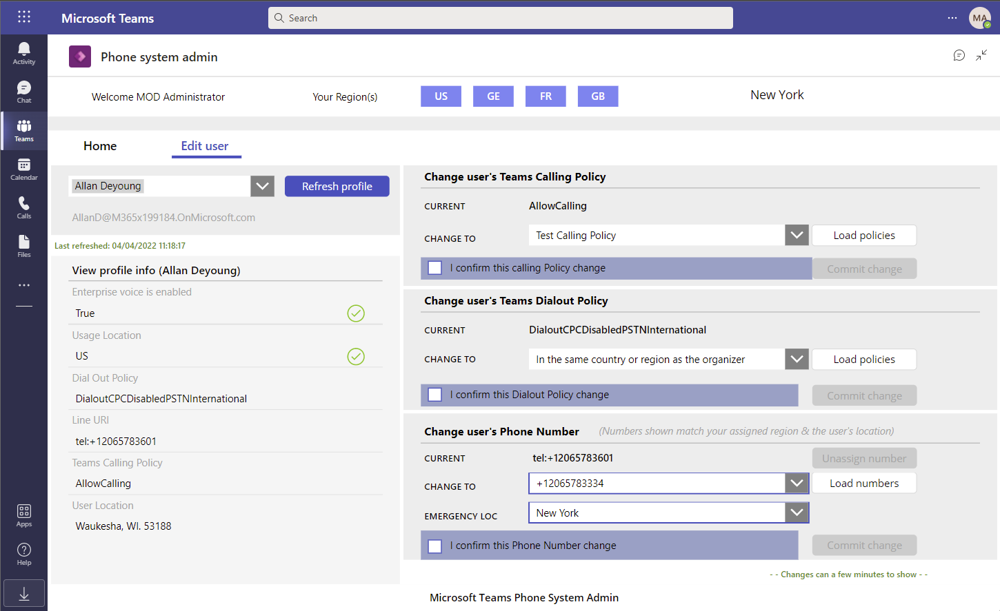
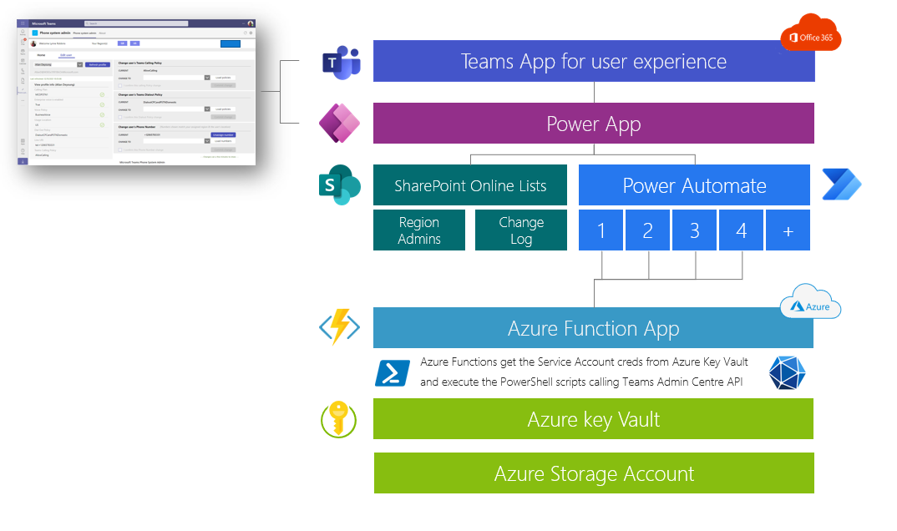

# Microsoft Teams Phone System admin app
A delegated Admin application for Calling Plans (PSTN) phone numbers management

## What's in it for you

Microsoft Teams provides an administration portal to manage the different telephony services for the organization. To access this portal, you need to assign one of the administrator roles defined [here](https://docs.microsoft.com/en-us/MicrosoftTeams/using-admin-roles). To manage the telephony system and assign telephone numbers or voice policies to users, the minimum required  role is "Teams Communications Administrator" - This role is then applied at the scope of the Azure AD tenant, meaning all users in your organization.

While this model works well well operations are managed centrally, it becomes more challenging when an organization needs to delegate these operations at local levels (e.g. per country) - This application provides an answer we a delegated management of the Telephony System based on the location of the users and permissions set for the delegated admins.

As of today, this application supports the following scenarios:
- Assign / Unassign PTSN numbers to a user
- Assign / unassign voice policies to a user
- only Calling Plans (aka PSTN) configuration is supported - Direct Routing is our of scope

The architecture of this solution can be adapted to support other scenarios taht require delegated admin management of Teams phone system or any other feature accessible via PowerShell cmdlet or even MS Graph API. 

Here is a screenshot of the application



<!-- <p align="center">
    
</p> -->


## Solution overview

### High Level Design

<br>


1. Users (central and local admins) access the application directly from Microsoft Teams - They are all members of an Office 365 Group with Central admins being the owners of the team and Local admin are members. **Only Central admin can manage Local admin permissions**.
2. The user-interface is provided by a Power Apps. **The Power Apps is only accessbile to the members of the O365 Group**.
3. Local app settings are stored in a SharePoint List - This list is only accessible to Central admins for right access - For each local admin, a list of country codes for delegated permissions is set (e.g. "US" / "FR" / "UK") - A Local admin can only manage users that have the "Usage Location" in Azure AD set to the their delegated country codes and can only manage telephone numbers with a matching "CityCode".
4. Actions validated on the Power Apps trigger a Power Automate flow - The role of the flow (one per API) is to **secure and log** all queries sent to the Teams Admin Center API's.
5. Azure KeyVault is used to securely store the secret and credentials required by the solution. With this design, secrets & credentials management of the "service account" and of the "service principal" can be delegated to a third party that is not an admin of the Team Telephony solution. 
6. Power Automate calls the Azure Function API providing the appropriate credentials.
7. The Azure Function get the "service account" credential that has the "Teams Communications Administrator" role and execute the PowerShell scripts
8. Azure AD conditional access checks the permissions and location of the request.


## How to deploy the solution
**Pre-requisites**

- Azure AD admin role to create a new user (a Service Account), assign roles and register a new application
- Azure AD Premium P1 license to enable Azure AD Conditional Access
- Azure Subscription and account with contributor role (to deploy resources)
- Power App license to deploy the application and Power Automate flows

To enable the connection to Azure KeyVault from the Power App, the user account logged on the Power App needs to have the minimum role of "Reader" on the Key Vault.  

**Step 1** - Create a Service Account in Azure AD

- Go to the [Azure AD portal](https://portal.azure.com/#blade/Microsoft_AAD_IAM/UsersManagementMenuBlade/MsGraphUsers) to manage users - Note: you need to have the appropriate permissions in Azure AD to create a new user.
- Add a new user (e.g. "Service Account Teams admin") and save the password - Note:you'll need to reset this password the first time you use this account - Please connect to https://portal.azure.com with the user credentials and provide a new **complex** password - **Store this password in a secured location**
- Go under "assigned roles" and assign the following roles :
  - Directory readers - to read the user profiles
  - Teams communications administration - to manage the Teams telephony system  

**Step 2** - Deploy the Azure resources

[](https://portal.azure.com/#create/Microsoft.Template/uri/https%3A%2F%2Fraw.githubusercontent.com%2Ftimoleo23%2FTeams-PhoneNumbersManager%2Fmain%2FDeployment%2FZipDeploy%2Fazuredeploy.json)

Here are the information requested for the deployment:
- **resourcePrefix**: the prefix to your Azure resourcecs names (e.g. Teams-)
- **Teams-service-account-name** : the UPN of the Service Account created in **step 1** 
- **Teams-service-account-secret** : the password of the Service Account created in **step 1**

Check the outputs of the deployment to get the values for Azure Function out-bound IP addresses (**outboundIpAddresses**) needed for the configuration of Azure AD Conditional Access (optional but recommended)

>__Note__: there is a known issue in the deployment that is expected to fail the first time with the following error "Encountered an error (ServiceUnavailable) from host runtime." - Please redeploy from the Azure portal for the deployment to succeed. We are working on a fix.

**Step 3** - Warm-up of the Azure Function 

The Azure Functions that run the PowerShell cmdlets are deployed on a dedicated plan - Cold start is a term used to describe the phenomenon that applications which haven’t been used take longer to start up, this typically happens when the functions are triggered for the first time (or after a restart or configuration change) - More info on [Understanding serverless cold start](https://azure.microsoft.com/en-us/blog/understanding-serverless-cold-start/)

It takes several minutes for the PowerShell function apps to install the required module - You can use the [script](.\Deployment\warmup.ps1) provided in this repository to warm-up the Azure Function. Here is how to call this script:
```PowerShell
$hostname = [Azure_Function_Hostname]
$code     = [Azure_Function_Code]
$tenantID = [Azure AD tenantID]
$clientID = [Azure AD application ID (aka client ID)]
$secret   = [Azure AD application secret]

.\Deployment\warmup.ps1 -hostname $hostname -code $code -tenantID $tenantID -clientID $clientID -secret $secret 
```

A successful warmup should look like that (by default, the script runs 3 times)

```PowerShell
TriggerTime         WorkerId Duration StatusCode StatusDescription
-----------         -------- -------- ---------- -----------------
14/12/2021 08:59:55        2     5,44        200 OK
14/12/2021 08:59:55        3     5,47        200 OK
14/12/2021 08:59:56        1     5,93        200 OK
```


**Step 4** - Deploy the Power App and flows

>**[ADD INSTRUCTIONS FOR POWER APP & FLOW HERE]**


At the end of this step, the solution should work end-to-end - The next-steps are recommended but optional and are here to add more security into the solution using Azure AD authentication & controls.

**Step 5** - Activate Azure AD Conditional Access

You can enable Azure Conditional Access on the Service Account used by your Azure Function app and restrict the trusted IP's to the one used by Azure Function. Azure AD Conditional Access requires a Premium P1 license to be assigned - More info here on [license requirements](https://docs.microsoft.com/en-us/azure/active-directory/conditional-access/overview#license-requirements).

- Go to the [Azure AD portal](https://portal.azure.com/#blade/Microsoft_AAD_IAM/ConditionalAccessBlade/Overview) for Conditional Access management
- Select "Named location" and create a new IP range location
- Provide a name (e.g. "Azure Function app Teams admin") and mark the location as trusted location
- Enter all the IP addresses provided in the output of the deployment in step #2 (**outboundIpAddresses**) - Append a "/32" to each IP address
- Click on Create
- Go to Policies and then click on "Create new policy"
- Provide a name to your policy
- For the Assignments:
  - Users or workload identities > **Include** "Select users and groups" > check "User and groups" > search for your Service Account > Select
  - Cloud apps or actions > **Include** "All cloud apps"
  - Conditions > Locations > **Exclude**  "Selected locations" > "Azure Function app Teams admin" (created earlier)
- For the Access Controls:
  - Grant > Block access
- Enable policy
- Save to confirm and apply the changes

<p align="center">
    
</p>

Note: please go back to your Power App and check that the application still responds - You can also try to use the Service Principal credential from your local desktop and verity you can't login anymore.

**Step 6** - Activate Azure AD auth on Azure Function

The next steps will guide you to activate Azure AD authentication between the Power Automate flows and the Azure Function endpoint using a service principal (Azure Ad app registration)


## Costs
(only provided as an example, as of December-2021 public prices)

>[TO BE COMPLETED] 

## Contributing

This project welcomes contributions and suggestions.  Most contributions require you to agree to a
Contributor License Agreement (CLA) declaring that you have the right to, and actually do, grant us
the rights to use your contribution. For details, visit https://cla.opensource.microsoft.com.

When you submit a pull request, a CLA bot will automatically determine whether you need to provide
a CLA and decorate the PR appropriately (e.g., status check, comment). Simply follow the instructions
provided by the bot. You will only need to do this once across all repos using our CLA.

This project has adopted the [Microsoft Open Source Code of Conduct](https://opensource.microsoft.com/codeofconduct/).
For more information see the [Code of Conduct FAQ](https://opensource.microsoft.com/codeofconduct/faq/) or
contact [opencode@microsoft.com](mailto:opencode@microsoft.com) with any additional questions or comments.


## Trademarks

This project may contain trademarks or logos for projects, products, or services. Authorized use of Microsoft
trademarks or logos is subject to and must follow
[Microsoft's Trademark & Brand Guidelines](https://www.microsoft.com/en-us/legal/intellectualproperty/trademarks/usage/general).
Use of Microsoft trademarks or logos in modified versions of this project must not cause confusion or imply Microsoft sponsorship.
Any use of third-party trademarks or logos are subject to those third-party's policies.

## Reference documentation

XXX